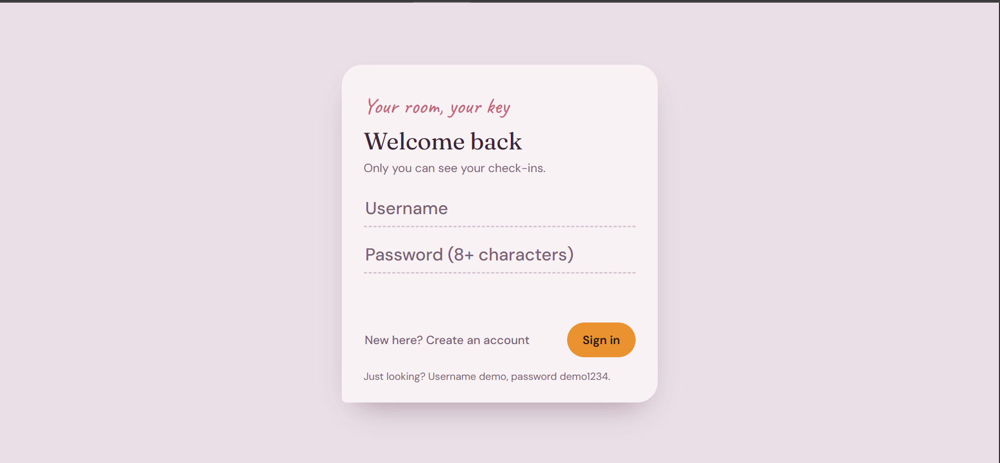
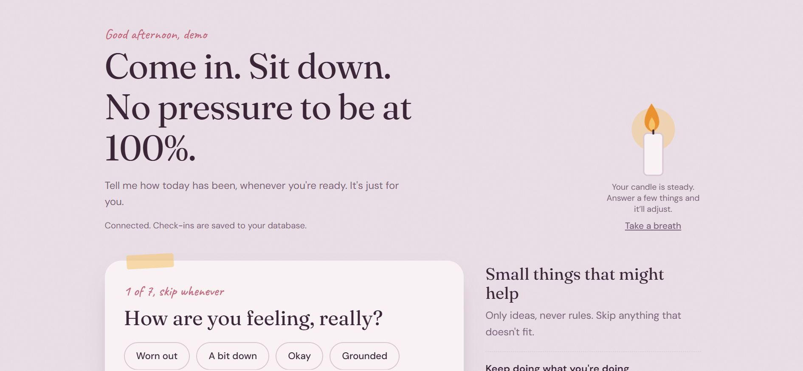
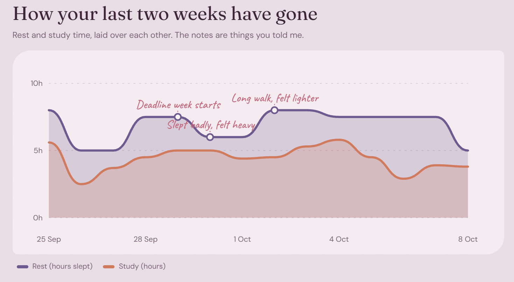
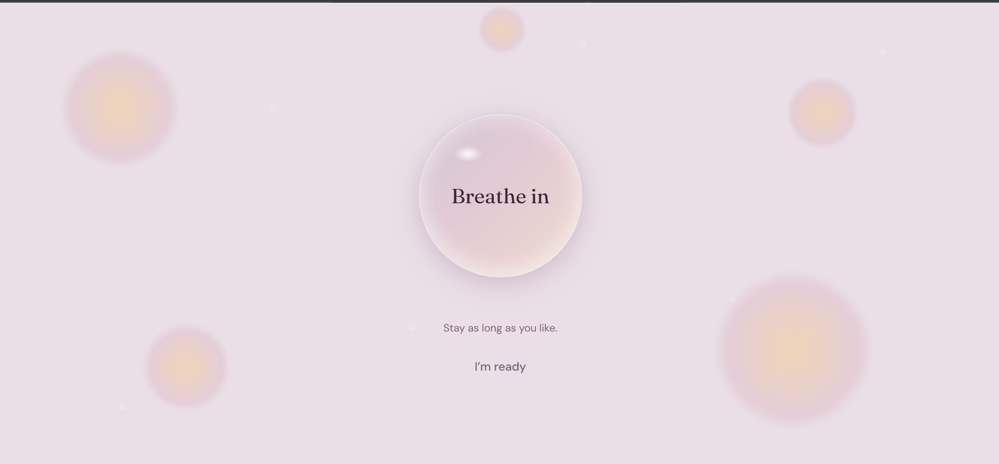
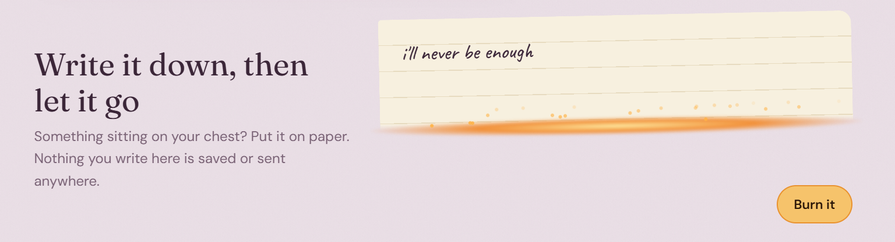
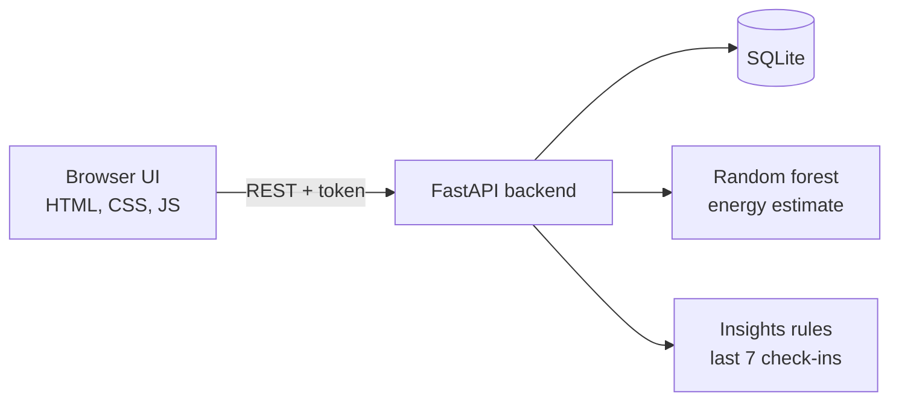

# AI-Based Student Well-Being Tracker

A calm, private web app where a student does a one-minute daily check-in (mood, pressure, sleep, study, water, exercise) and gets back an **energy estimate shown as a candle**, a **14-day rhythm chart** with their own notes, and **small suggestions that explain why they were made**.

It supports self-awareness. It does **not** diagnose anything and is not a substitute for professional care.

> B.Tech project, School of Computing Science and Engineering, VIT Bhopal University.

| Sign in | After signing-in |
|---|---|
|  |  |

| 14-day rhythm with notes | Breathing bubble |
|---|---|
|  |  |



## Features

- **One question at a time**: a seven-step check-in with gentle validation and no red warnings.
- **Energy as a candle**: a random forest estimates daily energy (0 to 100); the flame grows or shrinks.
- **Suggestions with reasons**: up to three tips from your last seven check-ins, each with a "Why this?".
- **Rhythm chart**: rest and study hours over 14 days, annotated with your own short notes.
- **Breathing bubble**: a 10-second cycle (in 4 s, hold 2 s, out 4 s), shown while loading or on demand.
- **Write and burn**: write a worry and watch it burn. The text never leaves the browser and is never stored.
- **Private accounts**: salted PBKDF2 password hashes, 30-day session tokens, per-user data, delete-my-data.
- **Time-aware**: the greeting changes by hour and the theme turns dark at night; respects reduced-motion.

## How it works



## Tech stack

Python 3.11, FastAPI, Uvicorn, SQLite, scikit-learn, pandas, NumPy. The interface is a single HTML file with plain CSS and JavaScript (no framework).

## Project structure

```
backend/
  main.py               API, authentication, model, insights
  test_api.py           automated API tests (pytest)
  requirements.txt      runtime dependencies
  requirements-dev.txt  test dependencies
frontend/
  index.html            the whole interface
docs/                   images used in this README
Dockerfile              container build
```

## Run it locally

You need Python 3.11 or newer.

```bash
git clone <your-repo-url>
cd wellbeing-project/backend

python -m venv .venv
# Windows:      .venv\Scripts\activate
# macOS/Linux:  source .venv/bin/activate

pip install -r requirements.txt
uvicorn main:app --reload --port 8000
```

Open <http://localhost:8000>. The API serves the interface, so one command runs everything. Interactive API docs are at <http://localhost:8000/docs>.

**Demo account:** username `demo`, password `demo1234` (14 days of sample data). Remove it before any public deployment.

If the page says it cannot reach the server, check that <http://localhost:8000/api/health> opens and that the `frontend` folder sits next to the `backend` folder.

## API

| Method | Endpoint | Purpose | Auth |
|---|---|---|---|
| POST | `/api/register` | Create an account, returns a token | No |
| POST | `/api/login` | Sign in, returns a token | No |
| POST | `/api/logout` | End the session | Token |
| POST | `/api/checkin` | Validate, predict, store | Token |
| GET | `/api/history` | Your own check-ins | Token |
| GET | `/api/insights` | Up to 3 suggestions with reasons | Token |
| DELETE | `/api/data` | Delete all your check-ins | Token |
| GET | `/api/health` | Service check | No |

Send the token as `Authorization: Bearer <token>`.

## Tests

```bash
cd backend
pip install -r requirements-dev.txt
pytest -q
```

Nine tests cover missing tokens, wrong and weak passwords, duplicate usernames, out-of-range values, note length, a valid check-in, per-user isolation and delete-only-your-own-data. The main user flow in the browser was also checked once with a scripted Playwright run (script not included).

## Deploy

- **Render (free):** push the repo to GitHub or GitLab, choose New, then Blueprint, and select the repo. Free services sleep when idle, and the SQLite file is wiped on restart.
- **Docker:** `docker build -t wellbeing .` then `docker run -p 7860:7860 wellbeing`.
- **Quick public link from your laptop:** `cloudflared tunnel --url http://localhost:8000`.

## Privacy

Accounts need only a username and password. No email or real name is collected. Every data query is filtered by the signed-in user, and tokens are stored only as hashes. The write-and-burn box makes no network request and writes nothing to browser storage.

## Limitations

- **The model is trained on synthetic data** generated from a hand-written formula, because no labelled real data existed yet. It demonstrates the pipeline and is not a validated predictor.
- The requirements survey had 32 respondents from one campus, so its findings are indicative.
- There has been no user trial, so effects on well-being and engagement are unknown.
- Before a public launch it needs HTTPS, login rate limiting, password reset, stricter CORS and removal of the demo account.

## Roadmap

1. Add a daily "how did today feel for focus and energy?" question to collect labelled data, then retrain and evaluate the model.
2. Run a consented pilot with a usability study.
3. Smart reminders, an optional counsellor link and optional smartwatch sleep data.

## Team

Anushka Verma, Bhavana Yadavalli, Jigisha Arora and Kanak Kamalkant Jha. Supervisor: Dr. Rajneesh Kumar Patel.

## Support

If you are struggling, please talk to your university counsellor or someone you trust. In India, the Tele-MANAS helpline is 14416 (check that the number is current before relying on it).
